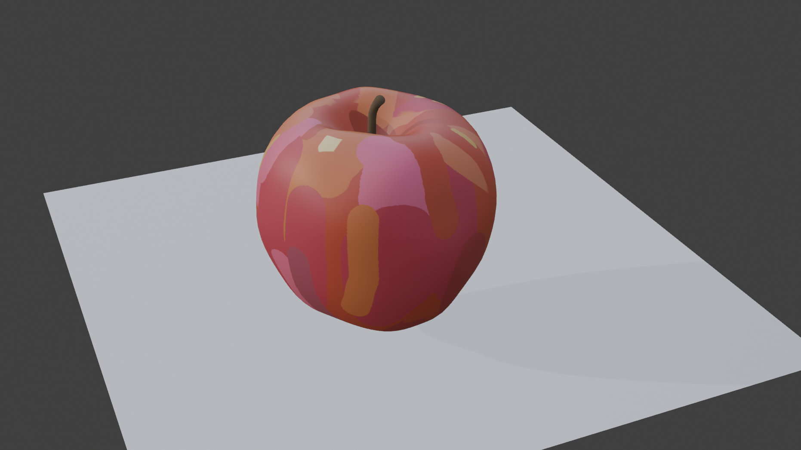
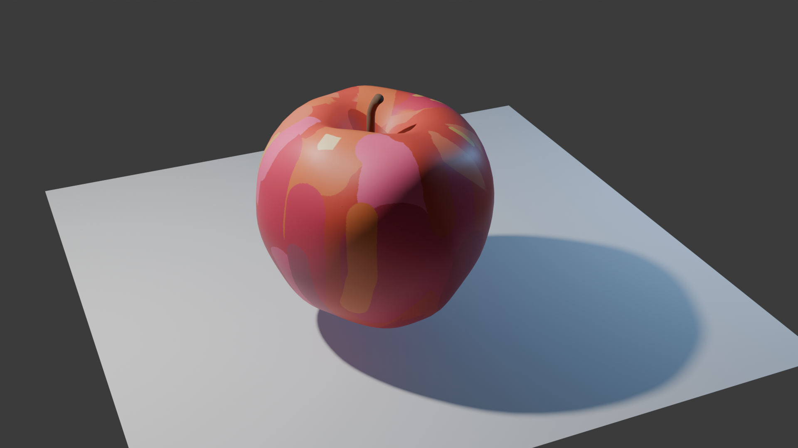
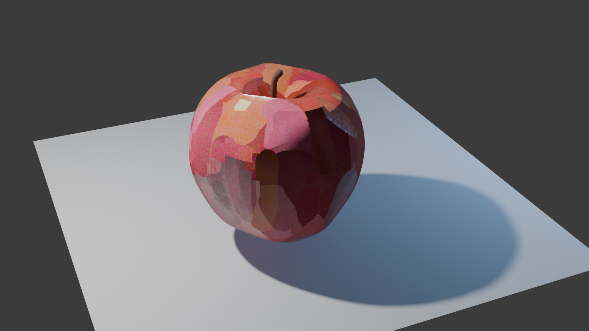

# NormalRepainter
Blender add-on that automatically 'repaints' a mesh's normal maps for a faceted, painterly, or comic-book effect.
Analyzes mesh normals and recomputes them in ultra-fast and optimized manner.

  
